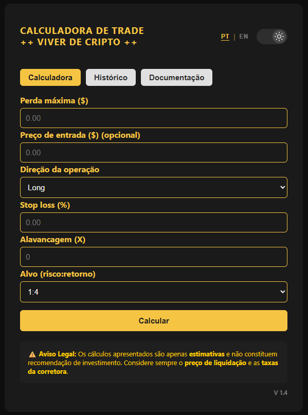

# 📊 Calculadora de Trade ++ Viver de Cripto ++

Português | [English Version](README.en.md)

Aplicação web desenvolvida para calcular operações de trade em múltiplas classes de ativos (criptomoedas, ações, commodities, forex), com foco em gestão de risco e dimensionamento de posição.

> **Acesse a aplicação:** **[Calculadora de Trade ++ Viver de Cripto ++](https://calculadoraviverdecripto.vercel.app/)**

---

## 🧠 Sobre o projeto

A aplicação permite calcular posições, margens e metas de lucro com base em parâmetros como perda máxima, stop loss, alavancagem e relação risco:retorno, com suporte opcional ao preço de entrada.

Foi desenvolvida com foco em precisão, usabilidade e agilidade na tomada de decisão, refletindo uma abordagem orientada à lógica matemática e aplicação prática no mercado financeiro.

Utilizada por traders da comunidade "Viver de Cripto", o projeto também demonstra a construção de interfaces responsivas e organização de código voltada a aplicações reais.

---

## ⚙️ Funcionalidades

- 📉 Cálculo de **perda máxima**, **tamanho de posição** e **margem utilizada**
- 🎯 Cálculo de **Stop-Loss** e **Take-Profit** em preço, com base no preço de entrada
- 📈 Suporte a operações **Long e Short** com alavancagem configurável
- 🔁 Seleção de **alvo risco:retorno** de 1:1 até 1:10
- 🕓 **Histórico de operações** salvo localmente
- 📤 **Exportação do histórico** em planilha `.xlsx`
- 🌙 **Modo claro/escuro** com detecção automática do sistema
- 📄 **Documentação técnica** integrada na própria aplicação
- 📱 Layout **responsivo** para mobile e desktop

---

## 🛠️ Tecnologias


- **HTML5, CSS3 e JavaScript (ES6+)** — sem frameworks
- **SheetJS (xlsx.js)** — exportação de histórico em planilha Excel
- **LocalStorage** — persistência do histórico e preferência de tema
- **Vercel** — deploy contínuo em produção
- **Claude Sonnet** — desenvolvimento assistido por IA & versão em inglês

---

## 🚀 Como usar

1. Acesse **[calculadoraviverdecripto.vercel.app](https://calculadoraviverdecripto.vercel.app/)**
2. Informe a **perda máxima** que aceita na operação
3. Informe o **preço de entrada** (opcional — ativa o cálculo de SL/TP em preço)
4. Selecione a **direção** (Long ou Short), o **stop loss (%)**, a **alavancagem** e o **alvo risco:retorno**
5. Clique em **Calcular**
6. Os resultados ficam salvos no **Histórico** e podem ser exportados em `.xlsx`

---

## 📁 Estrutura do projeto

```
📦 calculadora-trade
 ┣ 📄 index.html
 ┣ 📄 script.js
 ┣ 📄 style.css
 ┣ 📄 README.en.md
 ┣ 📄 README.md
 ┗ 📂 assets
    ┣ 📄 calculadora_de_trade_viver_de_cripto.xlsx
    ┣ 📄 doc.en.html
    ┣ 📄 doc.html
    ┣ 📄 doc.md
    ┣ 🖼️ interface.png
    ┣ 🌙 moon.svg
    ┣ 📄 style.css
    ┣ ☀️ sun.svg
    ┣ 📄 trade_calculator_en.xlsx
    ┣ 🖼️ trade_icon.png
    ┗ 🗑️ trash.svg
```

---

## ⚠️ Aviso Legal

Os cálculos apresentados são apenas **estimativas** e não constituem recomendação de investimento. Considere sempre o **preço de liquidação** e as **taxas da corretora** antes de operar.

---

## 👨‍💻 Autor

Desenvolvido por **Cassiano Cominetti**

---

### 📬 Contato

[](https://www.linkedin.com/in/cassianocominetti/)
[](mailto:cassianocmt@gmail.com)

---

## 🖥️ Interface


